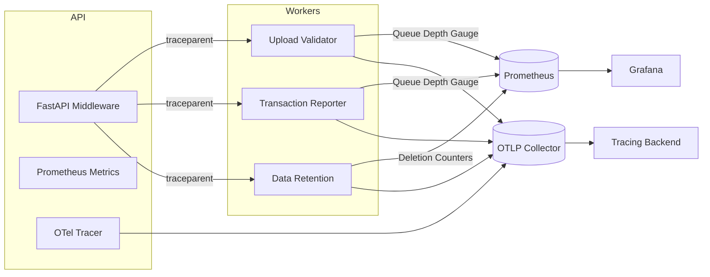

# Observability Data Flow

```mermaid
graph LR
    subgraph API
        A[FastAPI Middleware]
        B[Prometheus Metrics]
        C[OTel Tracer]
    end
    subgraph Workers
        D[Upload Validator]
        E[Transaction Reporter]
        F[Data Retention]
    end
    A -->|traceparent| D
    A -->|traceparent| E
    A -->|traceparent| F
    D -->|Queue Depth Gauge| G[(Prometheus)]
    E -->|Queue Depth Gauge| G
    F -->|Deletion Counters| G
    C --> H[(OTLP Collector)]
    D --> H
    E --> H
    F --> H
    G --> I[Grafana]
    H --> J[Tracing Backend]
```
